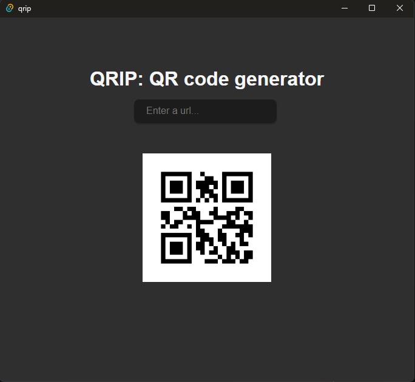

# QRIP - QR Code Generator

QRIP is a simple desktop application for generating QR Codes for anything you want.

## Installation

Please download from the Release page. QRIP supports the following platforms:

- Windows x64
- Linux x64

